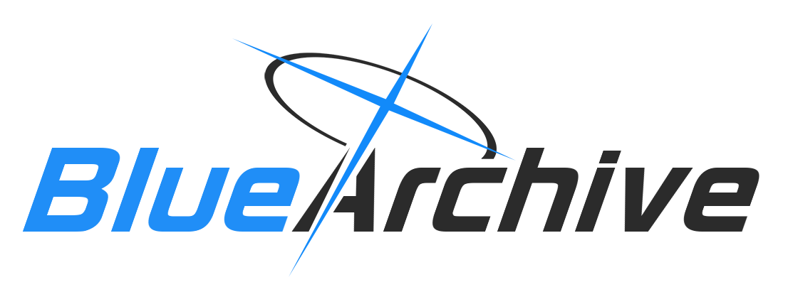

# BA Logo

[](https://www.npmjs.com/package/ba-logo)

一个用 `nodejs` 合成蔚蓝档案(Blue Archive)风格 Logo 的简单模块.




## 用法

```sh
# use npm
npm install ba-logo
# use yarn
yarn add ba-logo
```

```js
const baLogo = require('ba-logo')
baLogo('BlueArchive').then(image => {
  image.toFile('test.png')
  // 返回的是 sharp 实例
  image.toBuffer() // Promise<Buffer>
  image.pipe(createWriteStream()) // to stream
})
```

## 参数

```ts
baLogo(text: string | [string, string], left?: number)
```

`text` 可以是一个字符串, 也可以是两个字符串组成的数组, 为字符串时会自动切分为两段, 为数组时取前两项.

拆分规则大致为:

- 含有空格时, 以空格分割后取前两项
- 以大写字母开头, 且中间含有大写字母时, 按前两个大写字母开头的单词分割
- 对半分割(奇数时中间的字归后段)

可使用第二个可选参数 `left` 调整光环左右位置, 负数左移, 正数右移
